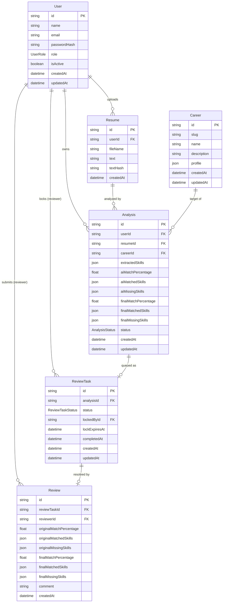

# CareerGap — Database Schema

PostgreSQL database managed by Prisma ORM. The schema models six entities across three domains: **users & auth**, **career catalog**, and **resume analysis & review pipeline**.

---

## Entity Relationship Overview



---

## Enums

### `UserRole`

| Value | Description |
|---|---|
| `USER` | Regular user who uploads resumes and views analysis results |
| `REVIEWER` | Human expert who verifies and corrects AI analysis results |
| `SUPER_ADMIN` | Platform administrator |

### `AnalysisStatus`

Represents the lifecycle of a single resume analysis request.

| Value | Description |
|---|---|
| `PENDING` | Analysis created, not yet picked up for processing |
| `PROCESSING` | AI skill extraction in progress |
| `REVIEW` | AI result ready, queued for human review |
| `COMPLETED` | Human reviewer has verified/corrected the result |
| `FAILED` | Analysis failed at the AI stage |

```text
PENDING → PROCESSING → REVIEW → COMPLETED
                              ↘ FAILED
```

### `ReviewTaskStatus`

Represents the state of a single task in the reviewer queue.

| Value | Description |
|---|---|
| `OPEN` | Available for any reviewer to claim |
| `LOCKED` | Currently held by a reviewer (time-limited) |
| `COMPLETED` | Reviewer has submitted the final review |

### `SkillImportance`

Used inside JSON `profile` fields on the `Career` model.

| Value | Description |
|---|---|
| `HIGH` | Core requirement for the career |
| `MEDIUM` | Commonly expected but not strictly required |
| `LOW` | Bonus/nice-to-have |

---

## Models

### `User`

Represents both regular users and reviewers. The `role` field determines their access level.

| Column | Type | Constraints | Description |
|---|---|---|---|
| `id` | `String` | PK, `uuid()` | Unique identifier |
| `name` | `String` | — | Display name |
| `email` | `String` | `@unique` | Login email |
| `passwordHash` | `String` | — | bcrypt-hashed password |
| `role` | `UserRole` | default `USER` | Access level |
| `isActive` | `Boolean` | default `true` | Soft-disable accounts |
| `createdAt` | `DateTime` | `@default(now())` | Account creation time |
| `updatedAt` | `DateTime` | `@updatedAt` | Last modification time |

**Indexes:** `role`, `isActive`

**Relations:**

| Field | Target | Description |
|---|---|---|
| `resumes` | `Resume[]` | Resumes uploaded by this user |
| `analyses` | `Analysis[]` | Analyses requested by this user |
| `lockedReviewTasks` | `ReviewTask[]` | Tasks currently held by this reviewer |
| `reviews` | `Review[]` | Reviews submitted by this reviewer |

---

### `Career`

Predefined career profiles seeded into the database. Serves as the target against which resumes are matched. Profiles are also cached in Redis for fast access.

| Column | Type | Constraints | Description |
|---|---|---|---|
| `id` | `String` | PK, `uuid()` | Unique identifier |
| `slug` | `String` | `@unique` | Machine-readable identifier |
| `name` | `String` | — | Human-readable name |
| `description` | `String` | — | Short career description |
| `profile` | `Json` | — | Skill requirements (see below) |
| `createdAt` | `DateTime` | `@default(now())` | — |
| `updatedAt` | `DateTime` | `@updatedAt` | — |

**`profile` JSON structure:**

```json
{
  "skills": [
    { "name": "Node.js",    "importance": "HIGH"   },
    { "name": "Docker",     "importance": "MEDIUM" },
    { "name": "Kubernetes", "importance": "LOW"    }
  ]
}
```

**Seeded careers:**

| Slug | Name |
|---|---|
| `backend_engineer` | Backend Engineer |
| `frontend_engineer` | Frontend Engineer |
| `ai_ml_engineer` | AI/ML Engineer |
| `devops_engineer` | DevOps Engineer |
| `data_engineer` | Data Engineer |

**Relations:** `analyses Analysis[]`

---

### `Resume`

Stores the extracted plain text of an uploaded resume file.

| Column | Type | Constraints | Description |
|---|---|---|---|
| `id` | `String` | PK, `uuid()` | Unique identifier |
| `userId` | `String` | FK → `User` | Owner of this resume |
| `fileName` | `String` | — | Original uploaded filename |
| `text` | `String` | — | Full extracted plain text |
| `textHash` | `String` | — | Hash of `text` for deduplication checks |
| `createdAt` | `DateTime` | `@default(now())` | Upload time |

**Indexes:** `userId`, `textHash`

**Relations:** `analyses Analysis[]`

> [!NOTE]
> `textHash` enables detecting duplicate uploads (same resume content) before triggering a new LLM call. The raw file is not stored — only extracted text.

---

### `Analysis`

The core entity of the platform. Records the full lifecycle of one resume-vs-career gap analysis, from raw AI output through to final human-verified result.

| Column | Type | Constraints | Description |
|---|---|---|---|
| `id` | `String` | PK, `uuid()` | Unique identifier |
| `userId` | `String` | FK → `User` | User who requested this |
| `resumeId` | `String` | FK → `Resume` | Resume being analyzed |
| `careerId` | `String` | FK → `Career` | Target career |
| `extractedSkills` | `Json` | — | Skills extracted from resume by AI |
| `aiMatchPercentage` | `Float?` | nullable | AI-computed match score |
| `aiMatchedSkills` | `Json?` | nullable | Skills present in both resume and career |
| `aiMissingSkills` | `Json?` | nullable | Skills in career but absent from resume |
| `finalMatchPercentage` | `Float?` | nullable | Human-verified final match score |
| `finalMatchedSkills` | `Json?` | nullable | Human-verified matched skills |
| `finalMissingSkills` | `Json?` | nullable | Human-verified missing skills |
| `status` | `AnalysisStatus` | default `PENDING` | Current lifecycle state |
| `createdAt` | `DateTime` | `@default(now())` | — |
| `updatedAt` | `DateTime` | `@updatedAt` | — |

**Indexes:** `userId`, `resumeId`, `careerId`, `status`, `(userId, status)`

**Relations:** `reviewTask ReviewTask?` (one-to-one, optional)

**JSON field shapes:**

```json
// extractedSkills
{ "skills": ["Node.js", "TypeScript", "Docker"] }

// aiMatchedSkills / finalMatchedSkills
{ "skills": ["Node.js", "TypeScript"] }

// aiMissingSkills / finalMissingSkills
{
  "skills": [
    { "name": "Docker",     "importance": "MEDIUM" },
    { "name": "Kubernetes", "importance": "LOW"    }
  ]
}
```

> [!NOTE]
> AI fields (`ai*`) are populated after the LLM skill extraction step. Final fields (`final*`) are populated after a reviewer approves or corrects the result. Until review, `final*` fields are `null`.

---

### `ReviewTask`

Represents a unit of work in the human reviewer queue. Created automatically when an `Analysis` reaches `REVIEW` status. Implements a **time-limited exclusive lock** to prevent two reviewers from working on the same task simultaneously.

| Column | Type | Constraints | Description |
|---|---|---|---|
| `id` | `String` | PK, `uuid()` | Unique identifier |
| `analysisId` | `String` | FK → `Analysis`, `@unique` | The analysis being reviewed |
| `status` | `ReviewTaskStatus` | default `OPEN` | Current queue state |
| `lockedById` | `String?` | FK → `User`, nullable | Reviewer currently holding the lock |
| `lockExpiresAt` | `DateTime?` | nullable | When the lock automatically expires |
| `completedAt` | `DateTime?` | nullable | When the review was submitted |
| `createdAt` | `DateTime` | `@default(now())` | — |
| `updatedAt` | `DateTime` | `@updatedAt` | — |

**Indexes:** `status`, `lockedById`, `lockExpiresAt`, `(status, lockExpiresAt)`

**Relations:** `review Review?` (one-to-one, optional)

**Lock mechanism:**

A reviewer claims a task via an atomic conditional update:

```sql
UPDATE review_tasks
SET
  status         = 'LOCKED',
  locked_by_id   = :reviewerId,
  lock_expires_at = NOW() + INTERVAL '15 minutes'
WHERE
  id = :taskId
  AND (status = 'OPEN' OR lock_expires_at < NOW());
```

- `affected rows = 1` → lock acquired
- `affected rows = 0` → task already held by another reviewer

If a reviewer abandons a task, the lock expires and the task becomes available again automatically via the `lock_expires_at < NOW()` condition.

> [!IMPORTANT]
> The `(status, lockExpiresAt)` composite index is critical for the reviewer dashboard query that lists `OPEN` tasks or tasks with expired locks efficiently.

---

### `Review`

The final human-verified result submitted by a reviewer. Created when a reviewer completes their assessment of a `ReviewTask`.

| Column | Type | Constraints | Description |
|---|---|---|---|
| `id` | `String` | PK, `uuid()` | Unique identifier |
| `reviewTaskId` | `String` | FK → `ReviewTask`, `@unique` | The task this resolves |
| `reviewerId` | `String` | FK → `User` | Reviewer who submitted this |
| `originalMatchPercentage` | `Float?` | nullable | Snapshot of AI score before correction |
| `originalMatchedSkills` | `Json?` | nullable | Snapshot of AI matched skills |
| `originalMissingSkills` | `Json?` | nullable | Snapshot of AI missing skills |
| `finalMatchPercentage` | `Float` | required | Reviewer-approved final score |
| `finalMatchedSkills` | `Json` | required | Reviewer-approved matched skills |
| `finalMissingSkills` | `Json` | required | Reviewer-approved missing skills |
| `comment` | `String?` | nullable | Optional reviewer notes |
| `createdAt` | `DateTime` | `@default(now())` | Submission time |

**Indexes:** `reviewerId`, `createdAt`

> [!NOTE]
> `original*` fields are a snapshot of the AI result at review time, preserved for auditing and measuring AI accuracy over time. They are optional because a reviewer may skip recording the original if they accept it as-is.

---

## Delete Behaviours

| Relation | `onDelete` | Rationale |
|---|---|---|
| `Resume → User` | `Cascade` | Deleting a user removes all their resumes |
| `Analysis → User` | `Cascade` | Deleting a user removes all their analyses |
| `Analysis → Resume` | `Cascade` | Deleting a resume removes its analyses |
| `Analysis → Career` | `Restrict` | Cannot delete a career with existing analyses |
| `ReviewTask → Analysis` | `Cascade` | Deleting an analysis removes its review task |
| `ReviewTask → User (lock)` | `SetNull` | Deleting a reviewer clears the lock, task reverts to open |
| `Review → ReviewTask` | `Cascade` | Deleting a task removes its review |
| `Review → User (reviewer)` | `Restrict` | Cannot delete a reviewer who has submitted reviews |

---

## Redis Layer

Redis sits alongside PostgreSQL and is **not** used for sessions or queues. Its two responsibilities are:

| Key pattern | Purpose | TTL |
|---|---|---|
| `career:profile:<slug>` | Career profile cache (avoids DB hit per request) | 24 hours |
| `career:lock:<slug>` | Distributed generation lock (prevents duplicate LLM calls) | 60 seconds |

When a Redis cache miss occurs, the system falls back to PostgreSQL — **no LLM call is made**. An LLM call only happens if the career profile is absent from both Redis and PostgreSQL.

